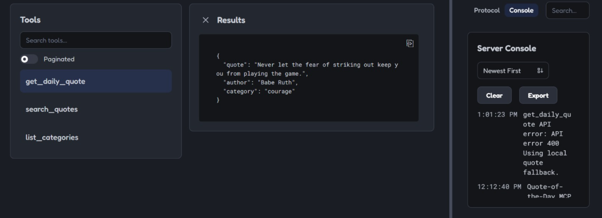
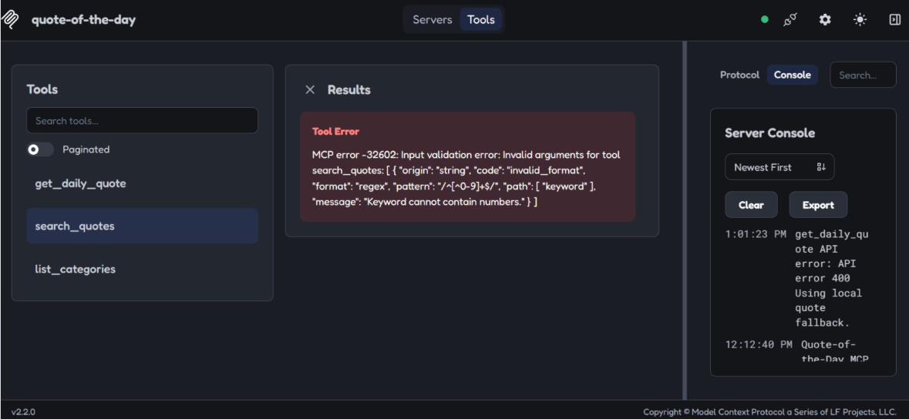
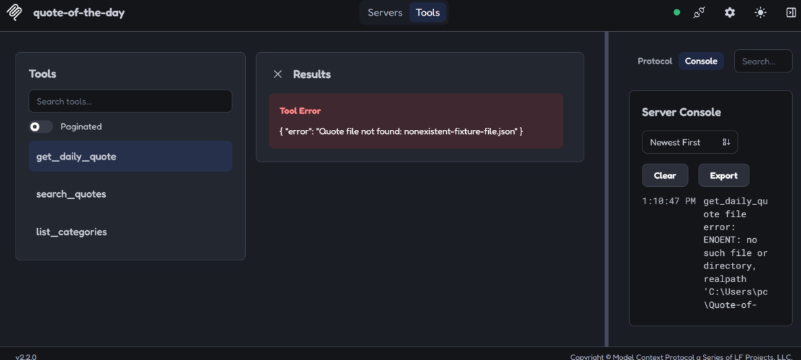

# Week 5 Manual Test Plan — quote-of-the-day MCP Server

**P0 tools covered:** `get_daily_quote`, `search_quotes`, `list_categories`

**Environment:** Executed in MCP Inspector against a clean state (default fixtures under the server's `data/` directory). These tools are read-only, so no fixture reset was needed between cases.

---

## Test Cases

| id | tool | setup | input | expected | result | evidence |
| :--- | :--- | :--- | :--- | :--- | :--- | :--- |
| TC1 | `get_daily_quote` | Default fixtures loaded, no file override | *(no params)* | Returns one valid quote object `{quote, author, category}` | **PASS** | `{"quote":"I have not failed. I've just found 10,000 ways that won't work.","author":"Thomas Edison","category":"perseverance"}` |
| TC2 | `search_quotes` | Default fixtures loaded | `keyword: "courage"` | Returns array of quotes matching keyword/category | **PASS** | 10 results returned, all tagged `category: "courage"` — matches `list_categories` count for that tag |
| TC3 | `list_categories` | Default fixtures loaded | *(no params)* | Returns array of available categories with counts | **PASS** | `{"ok":true,"count":8,"categories":[...]}` — 8 categories, counts sum to 60 quotes total |
| TC4 | `search_quotes` | Default fixtures loaded | `keyword: "12345"` (invalid — digits not allowed) | Rejected by Zod schema validation | **PASS** | `MCP error -32602: Keyword cannot contain numbers (regex ^[^0-9]+$)` |
| TC5 | `get_daily_quote` | Default fixtures loaded | `file: ""` (empty string, invalid) | Rejected by Zod schema validation | **PASS** | `MCP error -32602: Too small: expected string to have >=1 characters` |
| TC6 | `search_quotes` | Default fixtures loaded, keyword guaranteed to match nothing | `keyword: "zzzqqqnonexistentword"` | Handles no-match gracefully — empty array, no crash | **PASS** | `{"results":[]}` |
| TC7 | `get_daily_quote` | Fixture file missing — pointed `file` param at a filename that does not exist on disk | `file: "nonexistent-fixture-file.json"` | Graceful, sanitized error response (no internal path disclosure) | **PASS** (was FAIL, fixed) | See "Bug Found & Fixed" section below |
| TC8 | `get_daily_quote` | Network disabled locally (Wi-Fi off) to simulate the external API being unreachable | *(no params)* | Timeout or fallback to local file handled without crashing | **PASS** | `{"quote":"The only person you are destined to become is the person you decide to be.","author":"Ralph Waldo Emerson","category":"mindset"}` — 
|

---

## Bug Found & Fixed: TC7 — Internal Path Disclosure

### Original (broken) behavior

**Input:** `get_daily_quote` called with `file: "nonexistent-fixture-file.json"`

**Response:**
```json
{ "error": "ENOENT: no such file or directory, realpath 'C:\\Windows\\System32\\data'" }
```

### Problem

The raw Node.js filesystem error (`error.message`) was passed straight through to the MCP client. This leaked:
- The server's absolute internal filesystem path
- Raw Node error internals (`ENOENT`, `realpath`)

This is an information-disclosure issue in any MCP tool exposed to a model or end user, even though the underlying path-traversal protection in `readSafeQuoteFile()` was already implemented correctly.

### Fix

Added a `getSafeFileErrorMessage()` helper that maps internal errors to sanitized, user-facing messages based on `error.code`, instead of forwarding `error.message` directly. The full error is still logged via `console.error` on the server side for debugging — only the client-facing response changed.

```js
function getSafeFileErrorMessage(error, fileName) {
  const code = error?.code;

  if (code === "ENOENT") {
    return `Quote file not found: ${fileName}`;
  }
  if (code === "EACCES" || code === "EPERM") {
    return `Permission denied reading quote file: ${fileName}`;
  }
  if (error instanceof Error && error.message.startsWith("Path outside data directory")) {
    return "Invalid file path.";
  }
  if (error instanceof SyntaxError) {
    return `Quote file is not valid JSON: ${fileName}`;
  }
  if (error instanceof Error && error.message === "Quote file is empty or has an invalid format.") {
    return error.message;
  }

  return "Unable to read quote file.";
}
```

### Verified after fix

**Input:** `get_daily_quote` called with `file: "nonexistent-fixture-file.json"`

**Response:**
```json
{ "error": "Quote file not found: nonexistent-fixture-file.json" }
```

No internal path is exposed. Confirmed via Inspector — see screenshot evidence.

**Fixed in commit:** `8099c700c88d7fda3841eb89c9f59b4b7196a2c0`

### Follow-up (Later list, not fixed in this pass)

`DATA_ROOT = path.resolve(process.cwd(), "data")` resolves relative to the process's working directory at launch. During testing this pointed to two different unexpected locations (`C:\Windows\System32\data` and later `C:\Users\pc\Quote-of-...`) depending on how the server was started — confirming this is a `cwd`/launch-configuration issue, not a code defect. Follow-up: ensure any process that starts this server (MCP client config, service definition, etc.) sets an explicit `cwd` to the project root, so `DATA_ROOT` resolves consistently regardless of launch context.


## Screenshot Evidence (3 required)

1. **Happy path** — TC1  response panel showing a successful quote/results payload.
2. **Validation rejection** — TC4  response panel showing the Zod validation error.
3. **Empty/error case** — TC7  response panel showing the sanitized error after the fix (captured in Inspector, confirmed 1:10:47 PM run).

---

## Out of Scope / Later List

- `DATA_ROOT` / `cwd` resolution hardening (see follow-up note above)
- No new features were added during this pass — only the failure caught by TC7 was fixed, per the test plan scope.
